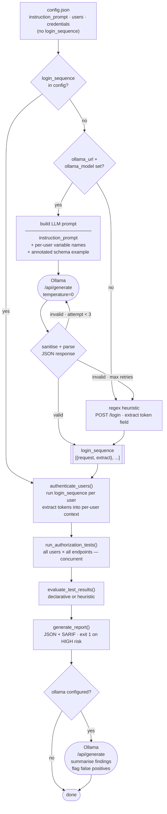

# iDOR-Scanner
Repository that aims to help with iDOR detection supported by AI.

## Architecture

### Overview

iDOR-Scanner is a single-file, zero-external-dependency Python CLI tool (`idor_scanner.py`). It requires only the Python standard library — no `pip install` needed beyond optional Flask for the demo target.

The tool is structured around three sequential phases:

```
load_config
  └─ apply_prompt_instruction_defaults   (derive login/tests from NL prompt / OpenAPI / Burp history)
        │
        ▼
choose_executor                          (DirectHTTP or BurpMCP)
        │
        ▼
authenticate_users  ──► (concurrent)    (run login_sequence for each user, extract tokens/cookies)
        │
        ▼
run_authorization_tests ──► (concurrent per test × user)
        │
        ▼
evaluate_test_results                   (expectation-based or heuristic)
        │
        ▼
maybe_generate_llm_summary              (optional Ollama call)
        │
        ▼
generate_report / generate_sarif_report (JSON + SARIF output, exit code 1 on high risk)
```

### LLM agent interaction



### Components

**Request execution (strategy pattern)**

Two executor implementations share the `RequestExecutor` interface:

- `DirectHTTPExecutor` — sends requests with `urllib` directly to the target. Supports custom timeouts, TLS verification bypass, and CA bundle pinning.
- `BurpMCPExecutor` — proxies every request through Burp Suite. On startup it probes the configured URL to auto-detect the transport: MCP SSE (opens an event-stream session, calls the `send_http1_request` tool) or legacy HTTP (simple JSON POST). All scanner traffic then appears in the Burp proxy history.

**Template engine**

Request specs are JSON objects with `{{variable}}` placeholders. `render_template()` resolves placeholders from the per-user context using dot-path notation (`{{user.token}}`) or environment variables (`{{env.SECRET}}`). Templates are rendered recursively across strings, dicts, and lists, so any field in a request — URL, headers, JSON body — can carry substitution markers.

**Configuration loading and prompt-driven defaults**

`load_config()` reads the JSON config and passes it through `apply_prompt_instruction_defaults()`, which inspects an optional `instruction_prompt` string and fills in missing sections:

1. If `login_sequence` is absent, it derives a default POST-to-`/login` step from the prompt.
2. If `authorization_tests` is absent and an OpenAPI spec is provided (inline or by path), it generates one test per operation, resolving `{param}` placeholders with configurable defaults.
3. If no OpenAPI spec is provided, it falls back to `burp_history_requests` / `burp_mcp_history_requests` and wraps each request as a test with an injected `Authorization: Bearer {{access_token}}` header.

**Authentication phase**

`authenticate_users()` runs the `login_sequence` for every user in a `ThreadPoolExecutor`. After each step, `extract_value()` pulls values from the response (JSON path, response header, `Set-Cookie`, or regex) and stores them in that user's context dict. The resulting per-user contexts carry all extracted tokens and variables forward into the test phase.

If no `login_sequence` is defined, each user can instead declare static `headers` (e.g. a pre-obtained bearer token) that are injected into every request for that user.

**Test execution phase**

`run_authorization_tests()` iterates over `authorization_tests`. For each test, all users fire the same request concurrently (another `ThreadPoolExecutor`). The request spec is rendered individually per user against that user's context, so every user sends requests with their own credentials.

**Finding evaluation**

`evaluate_test_results()` runs in one of two modes:

- **Declarative** (when `expectations.allowed_users` is set): compares each user's actual HTTP status against the declared list of allowed users. Unauthorized 2xx responses and unexpectedly-denied allowed users are flagged as high risk (`possible_idor_or_broken_access_control`). 404/410 responses for allowed users are medium risk (`possible_stateful_test_or_missing_fixture`) to reduce noise from stateful test data.
- **Heuristic** (no expectations): if all users receive 2xx with identical response bodies, it flags `possible_idor_identical_successful_access` (medium). If all users succeed but with different bodies, it flags `possible_cross_user_data_leak` (medium) and attaches full bodies for downstream LLM analysis.

**Report output**

The JSON report lists all findings with status codes, body hashes, body previews, and risk labels. SARIF output (`--output-sarif`) maps findings to six rules (IDOR-000 through IDOR-005) and emits `error`/`warning`/`note` levels, making results consumable by GitHub Advanced Security and other SARIF-aware tools. The process exits with code `1` if any high-risk finding is present, enabling clean CI gate integration.

**LLM-assisted login sequence generation**

If `ollama_url` and `ollama_model` are set and `login_sequence` is absent, `_generate_login_sequence_with_ollama()` sends the `instruction_prompt` to Ollama before the scan starts. The model receives the prompt, the available per-user variable names, and an annotated schema example, then returns a `login_sequence` JSON array. The scanner validates the result and falls back to the regex-based default if the model output cannot be parsed. This means a plain-English description of any login flow — multi-step, token-exchange, header-based — can be translated into a working sequence without hand-writing JSON.

**Optional LLM summary**

If `ollama_url` and `ollama_model` are set, `maybe_generate_llm_summary()` posts the full report JSON to a local Ollama instance and asks it to summarize authorization anomalies and probable false positives. The result is appended to the report as `llm_summary`.

---

## How this tool is designed to be used

iDOR-Scanner is built for security testers and developers who need to verify that authorization boundaries hold across multiple user roles against a real running API. It covers four main workflows:

**1. Direct API scan with a config file**

Write a JSON config that describes your users, a login sequence, and the endpoints to test. Run the scanner against your staging or dev environment. This is the fastest path — no proxy setup, no external tooling.

```bash
python idor_scanner.py --config config.json --output report.json
```

Use `expectations.allowed_users` in each test to get precise, per-operation verdicts. Without expectations the scanner falls back to heuristics (identical responses across users, all-success with different bodies).

**2. Burp Suite integration**

Set `burp_mcp_url` to your Burp MCP endpoint. All scanner traffic is then routed through Burp, so you get full request/response visibility in Burp's proxy history and can replay or modify individual requests. The scanner auto-detects whether Burp speaks MCP SSE or the legacy HTTP protocol.

This is the recommended workflow when you are already using Burp during a pentest engagement — the scanner turns Burp history into automated multi-user authorization checks.

**3. CI/CD pipeline gate**

Run the scanner in CI with `--output-sarif` to produce a SARIF file importable into GitHub Advanced Security or any SARIF-aware tool. The process exits with code `1` whenever a high-risk finding is detected, making it straightforward to fail a pipeline on a confirmed broken-access vulnerability.

```bash
python idor_scanner.py --config config.json --output-sarif results.sarif
echo $?   # 1 if high-risk findings, 0 otherwise
```

**4. OpenAPI- or Burp-history-driven test generation**

If you have an OpenAPI 3.0 spec, point `openapi_spec_path` at it and the scanner generates one authorization test per operation automatically. Combine with `openapi_expectation_overrides` to annotate which users should have access to which operations, and with `openapi_exclude_operation_ids` to skip auth endpoints.

If you have a Burp proxy history export instead, list the raw requests under `burp_history_requests` (or `burp_mcp_history_requests` for live Burp MCP history). The scanner wraps each request as a test and injects the per-user token.

Both sources can be combined with an `instruction_prompt` so the scanner derives the login sequence from natural language rather than requiring a hand-written `login_sequence` block.

---

## Autonomous scanner

This repository now includes an autonomous CLI scanner:

- consumes a JSON configuration that can describe a login/authentication sequence or per-user request headers,
- can derive the initial login sequence from a natural-language instruction prompt,
- authenticates **N users** and extracts tokens from responses,
- executes authorization test requests (direct HTTP or via `burp_mcp_url`),
- compares response status/body patterns and reports potential iDOR findings,
- can optionally request a final summary from an Ollama model (`ollama_url` + `ollama_model`).

Request timeout can be tuned with `http_timeout_seconds` (defaults to `20`).
For internal TLS endpoints, set `ollama_ca_bundle_path` to a PEM bundle trusted for `ollama_url`.

Run:

```bash
python idor_scanner.py --config /absolute/path/to/config.json
```

Relative paths also work, for example:

```bash
python idor_scanner.py --config config.json
```

Prompt override is also supported:

```bash
python idor_scanner.py --config config.json --instruction "go to login.example.com and obtain token for app.example.com use these 3 users"
```

### Prompt-driven defaults

If `instruction_prompt` is present and `login_sequence` is missing, the scanner derives a login step automatically. When `ollama_url` and `ollama_model` are also set, it sends the prompt to Ollama and uses the model's output as the `login_sequence` — enabling natural-language descriptions of arbitrary login flows (multi-step, token exchange, OAuth, cookie-based). If the Ollama call fails or returns unparseable output, the scanner falls back to a simple regex-based heuristic and prints a warning to stderr.
If `authorization_tests` is missing and `openapi_spec` or `openapi_spec_path` is provided, tests are derived from OpenAPI operations first.
If `authorization_tests` is missing and no OpenAPI source is provided, `burp_history_requests` (or `burp_mcp_history_requests`) is used and tests are derived from those requests with an injected `Authorization: Bearer {{access_token}}` header (when absent).
If you already have per-user credentials or tokens, `login_sequence` can be omitted and each user can define request `headers` applied to every request for that user.
If the prompt declares `use these N users`, the scanner validates that the config contains exactly `N` users.
If the prompt includes `verify all requests from burp MCP history`, history requests must be provided.
Use only one OpenAPI source (`openapi_spec` or `openapi_spec_path`) and only one Burp history source (`burp_history_requests` or `burp_mcp_history_requests`).
OpenAPI path parameters like `/users/{id}` default to `1`; customize with `openapi_path_param_default`.
For better OpenAPI-derived test quality, you can also use:

- `openapi_path_param_defaults` (map parameter names to values),
- `openapi_operation_path_param_defaults` (map operationId -> parameter map),
- `openapi_expectation_overrides` (map operationId -> expected allowed users),
- `openapi_exclude_operation_ids` (skip specific operationIds such as `login`).

Minimal config example:

```json
{
  "burp_mcp_url": "http://localhost:8081/mcp/request",
  "ollama_url": "http://localhost:11434",
  "ollama_model": "llama3.1",
  "users": [
    {"name": "alice", "variables": {"username": "alice", "password": "alice-pass"}},
    {"name": "bob", "variables": {"username": "bob", "password": "bob-pass"}}
  ],
  "login_sequence": [
    {
      "request": {
        "method": "POST",
        "url": "https://target.example/api/login",
        "json": {"username": "{{username}}", "password": "{{password}}"}
      },
      "extract": {
        "access_token": {"from": "json", "path": "token"}
      }
    }
  ],
  "authorization_tests": [
    {
      "name": "read-account-1001",
      "request": {
        "method": "GET",
        "url": "https://target.example/api/accounts/1001",
        "headers": {"Authorization": "Bearer {{access_token}}"}
      },
      "expectations": {
        "allowed_users": ["alice"]
      }
    }
  ]
}
```

### Expectation mismatch classification

When `expectations.allowed_users` is provided:

- unauthorized successes are reported as `high` risk (`possible_idor_or_broken_access_control`),
- expected-allowed users receiving `401/403` are reported as `high` risk,
- expected-allowed users receiving `404/410` are reported as `medium` risk (`possible_stateful_test_or_missing_fixture`) to reduce false positives caused by stateful test data,
- other expected-allowed failures are reported as `medium` risk.

LLM-assisted login sequence example (Ollama generates the `login_sequence` from the prompt):

```json
{
  "ollama_url": "http://localhost:11434",
  "ollama_model": "llama3",
  "instruction_prompt": "POST to https://auth.corp/api/login with JSON body username and password. Extract the bearer token from the 'token' field in the JSON response. Use it as Authorization: Bearer {{access_token}} on all subsequent requests.",
  "users": [
    {"name": "alice", "variables": {"username": "alice", "password": "alice-pass"}},
    {"name": "bob",   "variables": {"username": "bob",   "password": "bob-pass"}}
  ],
  "authorization_tests": [
    {
      "name": "read-account",
      "request": {
        "method": "GET",
        "url": "https://app.corp/api/accounts/1001",
        "headers": {"Authorization": "Bearer {{access_token}}"}
      },
      "expectations": {"allowed_users": ["alice"]}
    }
  ]
}
```

No `login_sequence` is needed — Ollama synthesises it from the prompt. If the model is unavailable or returns invalid JSON the scanner falls back silently.

Instruction-based config example:

```json
{
  "instruction_prompt": "Hi, go to login.example.com and use username/password to obtain token for app.example.com, use these 3 users to test given in burp history requests",
  "users": [
    {"name": "alice", "variables": {"username": "alice", "password": "alice-pass"}},
    {"name": "bob", "variables": {"username": "bob", "password": "bob-pass"}},
    {"name": "carol", "variables": {"username": "carol", "password": "carol-pass"}}
  ],
  "burp_history_requests": [
    {"method": "GET", "url": "https://app.example.com/api/profile/100"},
    {"method": "GET", "url": "https://app.example.com/api/profile/101"}
  ]
}
```

OpenAPI-based config example:

```json
{
  "instruction_prompt": "go to login.example.com and obtain token for app.example.com use these 2 users",
  "users": [
    {"name": "alice", "variables": {"username": "alice", "password": "alice-pass"}},
    {"name": "bob", "variables": {"username": "bob", "password": "bob-pass"}}
  ],
  "openapi_spec_path": "/absolute/path/to/openapi.json"
}
```

Per-user header example without login sequence:

```json
{
  "users": [
    {"name": "john", "headers": {"Authorization": "Bearer X"}},
    {"name": "bob", "headers": {"Authorization": "Bearer Y"}}
  ],
  "authorization_tests": [
    {
      "name": "read-account-1001",
      "request": {
        "method": "GET",
        "url": "https://target.example/api/accounts/1001"
      }
    }
  ]
}
```

A ready-to-run token-only demo config is also included at `example/flask_idor_demo_config_tokens_only.json`.

## Local Flask example target

A runnable demo target is available in `example/`.

- `example/flask_idor_demo.py` starts a Flask server with 3 users (`admin`, `editor`, `viewer`), 13 example endpoints, and 3 intentional broken-access flaws.
- `example/flask_idor_demo_config.json` is a ready-to-run scanner configuration for that demo server.
- `example/flask_idor_demo_config_ollama.json` adds an Ollama-backed summary using `https://ollama.kscsc.local`.
- `example/flask_idor_demo_config_llm_login.json` demonstrates LLM-generated login sequences: omits `login_sequence` and lets Ollama synthesise it from `instruction_prompt`, then tests all 15 endpoints including three additional invoice ownership tests not present in other configs.
- `example/flask_idor_demo_config_tokens_only.json` shows a no-login configuration that uses only per-user bearer tokens for the local demo app.
- `example/flask_idor_demo_config_openapi.json` demonstrates deriving tests from `example/flask_idor_demo_openapi.json`.
- `example/flask_idor_demo_config_burp_history.json` demonstrates deriving tests from Burp-history-style requests.
- `example/flask_idor_demo_config_burp_mcp.json` demonstrates routing scanner traffic through Burp MCP SSE (`http://127.0.0.1:9876/`).
- `example/flask_idor_demo_config_burp_mcp_openapi.json` demonstrates OpenAPI-derived tests executed through Burp MCP SSE.
- `example/README.md` explains how to run the sample locally.

The demo app also exposes `GET /` as a crawl-friendly landing page and `GET /openapi.json` for local OpenAPI testing.

If Ollama summarization fails, the report now includes `llm_summary_error` with a short error message.
When using HTTPS with internal certificates, set `ollama_ca_bundle_path` to the CA chain file (PEM).
